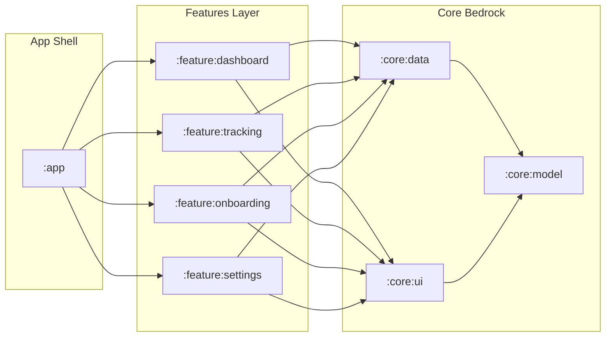
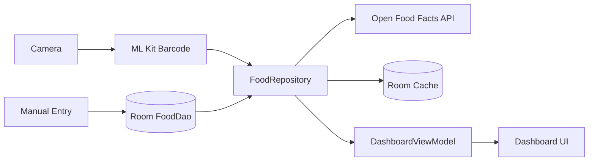
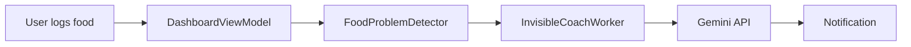

# Calorie Tracker

Personal Android app for logging food, tracking weight, and getting unsolicited Gemini coaching about your lunch choices.

## What it does

- **Barcode scanning** — point camera at a product, get nutritional info from Open Food Facts
- **Manual food log** — add/skip/delete entries, see daily macro totals on gauges
- **Weight tracking** — log weight, view progress over time
- **Coach** — after you log something questionable, Gemini judges you via notification

## Module architecture



- **`:core:model`** — pure Kotlin JVM, zero Android dependencies. Data classes + serialization.
- **`:core:data`** — Room DB, repositories, Retrofit APIs, WorkManager workers, Gemini integration.
- **`:core:ui`** — Shared Compose components and theming.
- **`:feature:*`** — Screens, ViewModels, per-feature Koin modules.

## Data flow





## What's rough

- **OCR food recognition** via Google Vision is unreliable — don't trust it
- **No meal grouping** — entries are a flat list per day
- **Coach occasionally tells you to eat a salad while you're eating pizza** — it's AI, not a nutritionist
- **Single user, single device** — no accounts, no sync
- **No tests for the ViewModels** — architecture tests exist but business logic is untested

## Build

Requires Android Studio Ladybug+, JDK 21, Gradle 9.4.

```bash
# Coach feature needs this (optional — everything else works without it)
echo "GEMINI_API_KEY=your_key_here" > secrets.properties
```

## Tech

Kotlin 2.1, Jetpack Compose, Room, Retrofit + Kotlinx Serialization, Koin, WorkManager, CameraX, ML Kit.
